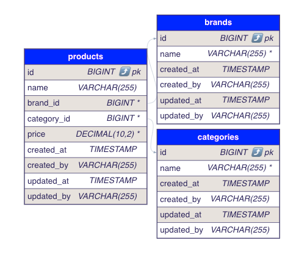
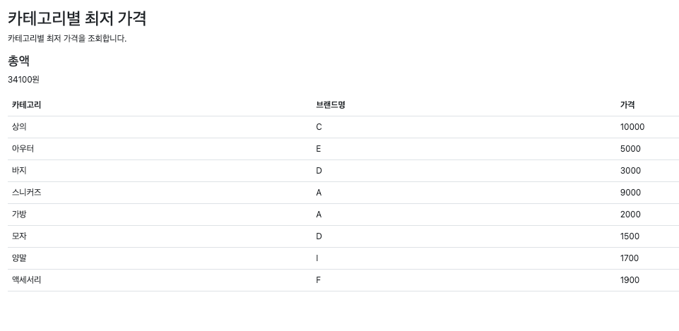
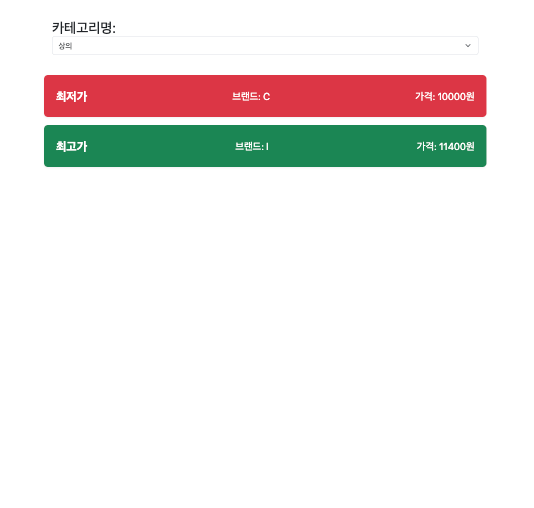
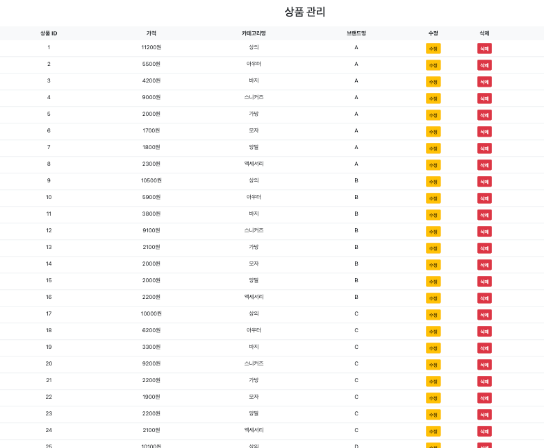

# 무신사 백엔드 과제 - 이준호

- 이 프로젝트는 Kotlin과 Spring을 사용하여 개발된 서버 애플리케이션입니다.

## 🛠 기술 스택

- Language: Kotlin 1.9 (JVM 21)
- Backend: Spring Boot 3.4.2, JPA
- Database: H2
- API Testing: JUnit5
- Containerization: Docker, Docker Compose

## ERD



## 주요 기능

- 최종 구현된 범위입니다

1. 카테고리 별 최저가 조회 [링크](http://localhost:8080/products/lowest-price-by-category)



- 카테고리에 해당하는 상품 전체 목록을 조회해온다. 
- 상품을 카테고리 별로 구분해, Map 형태로 반환합니다. Key는 카테고리 이름, Value는 해당 카테고리 상품 목록이다.  
  - 상품 목록은 가격을 기준으로 내리차순 되어 있어, 첫번째 상품이 최저가이다.
  - 총액은 해당 카테고리의 최저가 상품들의 가격을 합산한 값입니다.  

2. 최저 가격 브랜드 조회 [링크](http://localhost:8080/products/lowest-price-brand)


- 브랜드 별 가격 총합을 조회합니다.
- 이 중에서 총합이 가장 작은 브랜드를 반환한다.
- 해당 브랜드의 상품 목록을 조회해온다. 

3. 카테고리 별 가격 조회 [링크](http://localhost:8080/products/price-range)



- 카테고리 이름을 기반으로 카테고리를 조회해온다. 
- 카테고리를 조회한 후, 해당 카테고리의 상품 목록을 최저가, 최고가를 조회해온다.

4. 상품 관리 [링크](http://localhost:8080/products/manage)



- 상품을 생성, 수정, 삭제 할 수 있습니다.

## 확인 순서

1. **애플리케이션 실행**

```bash
./gradlew bootRun
```

- 서버는 `http://localhost:8080`에서 실행됩니다. 
  - 프론트엔드 화면도 포함되어 있습니다. 

2. 테스트코드 실행 확인

```bash
./gradlew test
```

- 주요 서비스에 대한 테스트가 작성 되었습니다. 

3. **API 호출**: Postman API 문서를 사용하여 이러한 API를 호출할 수 있습니다.
    - Postman API 문서 : [API 문서](https://documenter.getpostman.com/view/18460012/2sAYX2Pju7#b38a4d96-cc1e-406f-9792-22e0bfd6cce0)
    - 프로젝트를 Workspace로 Import하여 API 문서를 확인할 수 있습니다.

## API Spec

### 1. 카테고리 별 최저가 조회

- **URL:** `GET /v1/products/lowest-price-by-category`
- **Request:** 없음
- **Response:**
    - **`200 OK`**
    - **Content-Type:** `application/json`
    - **Body:**
        - `totalAmount` (Double) : 카테고리 별 최저가 상품들의 가격을 합산한 값
        - `categories` (List<Object>) : 카테고리 별 최저가 상품 목록
            - `id` (Long) : 카테고리 ID
            - `name` (String) : 카테고리 이름
            - `brandName` (String) : 브랜드 이름
            - `price` (Double) : 상품 가격

```json
{
  "totalAmount": 34100.00,
  "categories": [
    {
      "id": 1,
      "name": "상의",
      "brandName": "C",
      "price": 10000.00
    },
    {
      "id": 2,
      "name": "아우터",
      "brandName": "E",
      "price": 5000.00
    },
    {
      "id": 3,
      "name": "바지",
      "brandName": "D",
      "price": 3000.00
    },
    {
      "id": 4,
      "name": "스니커즈",
      "brandName": "A",
      "price": 9000.00
    },
    {
      "id": 5,
      "name": "가방",
      "brandName": "A",
      "price": 2000.00
    },
    {
      "id": 6,
      "name": "모자",
      "brandName": "D",
      "price": 1500.00
    },
    {
      "id": 7,
      "name": "양말",
      "brandName": "I",
      "price": 1700.00
    },
    {
      "id": 8,
      "name": "액세서리",
      "brandName": "F",
      "price": 1900.00
    }
  ]
}
```

### 2. 최저 가격 브랜드 조회

- **URL**: `GET /v1/products/lowest-price-brand`
- **Request**: 없음
- **Response**
  - **Status Code**: `200 OK`
  - **Content-Type**: `application/json`
  - **Body**:
      - `minPrice` (Object) : 최저 가격 브랜드 정보
          - `brandName` (String) : 최저 가격 브랜드 이름
          - `categories` (List<Object>) : 최저 가격 브랜드의 상품 목록
              - `id` (Long) : 카테고리 ID
              - `name` (String) : 카테고리 이름
              - `price` (Double) : 상품 가격
          - `totalAmount` (Double) : 최저 가격 브랜드의 상품 가격 합산 값

```json
{
    "minPrice": {
        "brandName": "D",
        "categories": [
            {
                "id": 1,
                "name": "상의",
                "price": 10100.00
            },
            {
                "id": 2,
                "name": "아우터",
                "price": 5100.00
            },
            {
                "id": 3,
                "name": "바지",
                "price": 3000.00
            },
            {
                "id": 4,
                "name": "스니커즈",
                "price": 9500.00
            },
            {
                "id": 5,
                "name": "가방",
                "price": 2500.00
            },
            {
                "id": 6,
                "name": "모자",
                "price": 1500.00
            },
            {
                "id": 7,
                "name": "양말",
                "price": 2400.00
            },
            {
                "id": 8,
                "name": "액세서리",
                "price": 2000.00
            }
        ],
        "totalAmount": 36100.00
    }
}
```

### 3. 카테고리 별 가격 조회

- **URL**: `GET /v1/products/price-range?categoryName=상의`
- **Request**: 
  - **Query Parameter**:
      - `categoryName` (String) : 카테고리 이름  
        _(예: 상의, 아우터, 바지, 스니커즈, 가방, 모자, 양말, 액세서리)_

- **Response**:
  - **Status Code**: `200 OK`
  - **Content-Type**: `application/json`
  - **Response Body**:
      - `categoryName` (String) : 카테고리 이름
      - `minPrice` (Object) : 최저 가격 상품 정보
          - `brandName` (String) : 최저 가격 브랜드 이름
          - `price` (Double) : 최저 가격 상품 가격
      - `maxPrice` (Object) : 최고 가격 상품 정보
          - `brandName` (String) : 최고 가격 브랜드 이름
          - `price` (Double) : 최고 가격 상품 가격

```json
{
    "categoryName": "상의",
    "minPrice": {
        "brandName": "C",
        "price": 10000.00
    },
    "maxPrice": {
        "brandName": "I",
        "price": 11400.00
    }
}
```